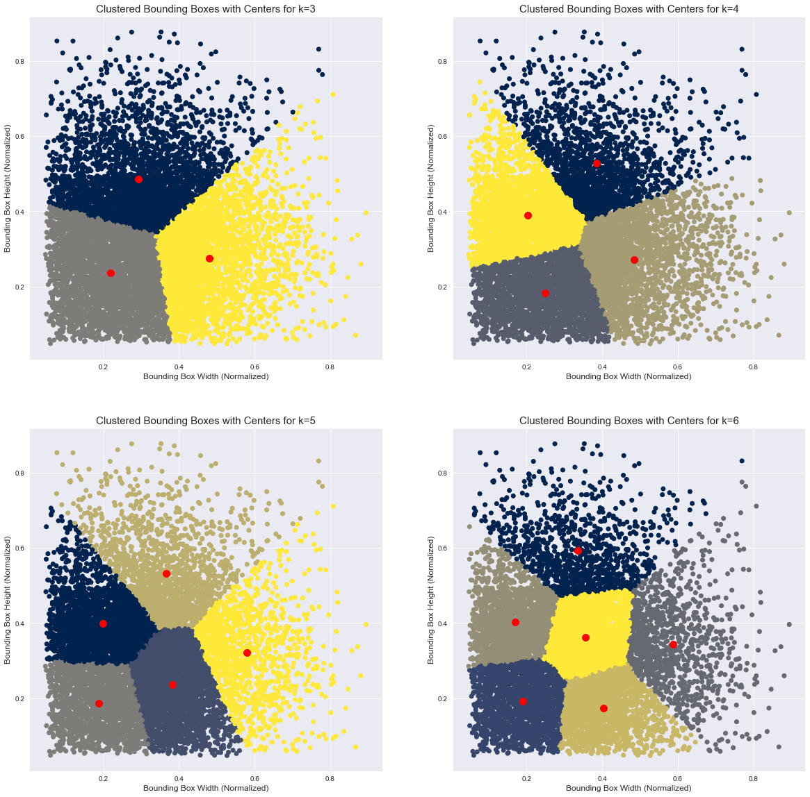
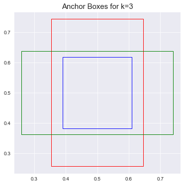
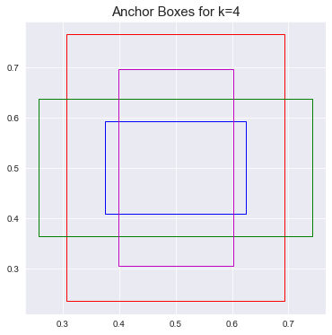
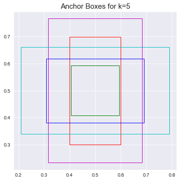
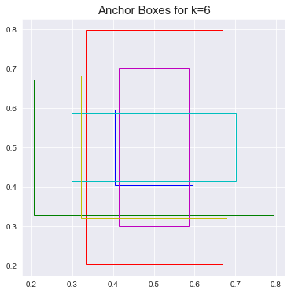

# Anchor box creation for Sample Coco Annotations, using KMeans Clustering algorithm

## Objectives
* [ ] To understand the COCO dataset and its schema.
* [ ] Map the class names to the sample data and analyze the class distribution.
* [ ] Identify the clusters using K-means for K = 3,4,5,6, thereby identifying the bounding boxes and plotting them.

## Understanding the COCO Dataset
COCO (Common Objects in Context) is a large-scale object detection, segmentation, and captioning dataset.

